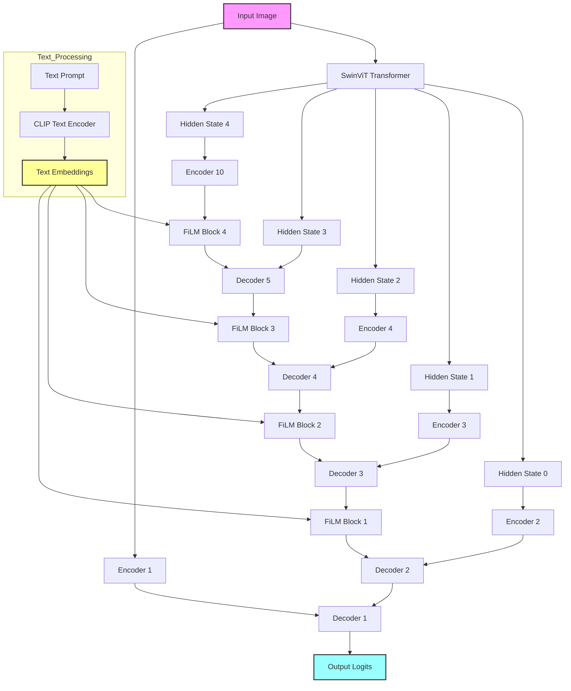
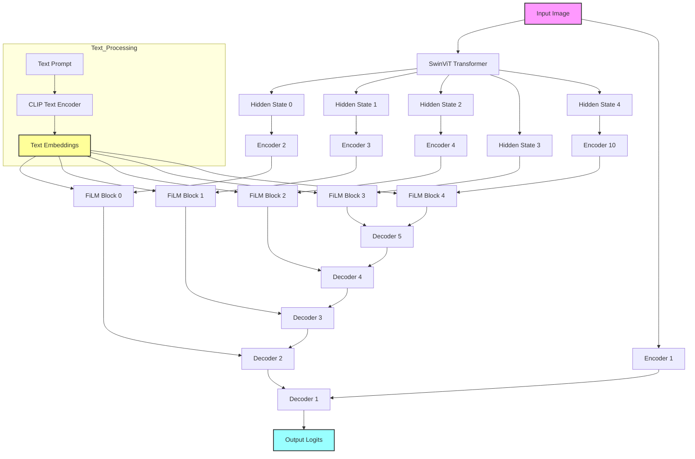

# Deep FiLM Image-Text Model

This project implements a CLIP-Deep-Driven FiLM and CLIP-Deep-FIlM-2 (Feature-wise Linear Modulation) model for image-text tasks. It builds upon the Universal CLIP architecture, using film-based modules to modulate image embeddings at each decoder with embeddings from the text-based decoder.

## CLIP-Deep-Driven Architecture
The architecture for train_deep_film.py


## Deep_film_2 Architecture



## Setup

The required environment files are present inside the env_file folder.

1. Install the required environment:
   ```
   conda env create -f environment.yml
   ```

2. Download the dataset as specified in the Universal CLIP paper.

## Training

Training
For each dataset create DatasetName_train.txt DatasetName_test.txt DatasetName_val.txt under the /dataset/datasetlist folder

The model will look out for the training dataset list for DatasetName that contains the training files like {img,’\t’,seg} _train.txt and _val.txt important to get the training started associated with the data

To train the model, use the `train_deep_film.py` or `train_deep_film_2.py` script:

```
python -m torch.distributed.launch --nproc_per_node=8 --master_port=1234 train_deep_film.py --dist True --uniform_sample
```

The training recipe is similar to that described in the Universal CLIP paper.

## Distributed Training (For deep_film_2_multinode)

```
srun python train_deep_film_2_multinode.py \
    --dist True \
    --uniform_sample \
    --num_workers 4 \
    --log_name deep_film_2_multinode_og_setting \
    --world_size $WORLD_SIZE \
    --master_addr $MASTER_ADDR \
    --master_port $MASTER_PORT

```

## Evaluation

To evaluate the model, use the `model_test.py` and `model_val.py` script:
For both test and val the  pair location must be there in the datase

```
Model_val.py —pretrain <your_pretrain_folder> –model_type <model_name> –file_name <file_name_for_result> –datasetlist <txt file containing image_seg_pair of datalist>
```

Note:- At datasetlist just type the name of the dataset.


Model_name = universal, swinunetr, unetr, film 

```
Model_test.py —pretrain <your_pretrain_folder> –model_type <model_name> –file_name <file_name_for_result> -–datasetlist <txt file containing image_seg_pair of datalist>
```

To create data list
If PAOT is the dataset then PAOT_train contains the {img,’\t’,seg}  type and similarly for PAOT_test and PAOT_val

Just write the DatasetName with argumen –datasetlist 

Example Scirpts

```
python model_test.py --pretrain ./out/unetr_monai/epoch_160.pth --model_type unetr --file_name unetr_paot_btcv_test_e160.txt --dataset_list btcv
```


```
python model_val.py --pretrain ./out/unetr_monai/epoch_160.pth --model_type unetr --file_name unetr_paot_btcv_e160.txt --dataset_list btcv3
```

### Preparing Test Data

Before evaluation, you need to create a test dataset file:

1. Create a file named `dataset_text.txt`.
2. In this file, list the locations of the files in your text directory.
3. Format each line as follows:
   ```
   file_path<tab>label
   ```

## Saving Results

To save your prediction results, use the `save_result` function from `gg_tools.py`.
Or you can use `model_test_save_predictions_final.py`.
Here the loader will take `_test2.txt` files. These files dont have their ground truths. So inside datasetname_test2.txt files, it should contain the names of the files to be predicted

## Some predictions

Predictions of train_deep_film or CLIP-DEEP-Driven Model

![12-CT-ORG][images/13_AbdomenCT-12organ_label_Organ12_0020_axial_slice_106_comparison 1.png]
![KiTS][images/05_KiTS_label_label0071_axial_slice_161_comparison 1.png]
![AMOS][images/09_AMOS_label_amos_0111_axial_slice_305_comparison 1.png]

## Notes

- This project is based on the Universal CLIP architecture with modifications.
- The Deep FiLM model modulates image embeddings using text-based decoder outputs.
- Ensure you have the necessary computational resources for training and evaluation.
- train_deep_film_2 contains fixes for abritrary text input
- train_deep_film_2 uses film module with pre residual normalization and residual layer.
- train_val train files are with different custom data loader than normal train files. The noraml train files brought more accuracy due to uniform sampling

For more detailed information on the Universal CLIP architecture, please refer to the original paper.
